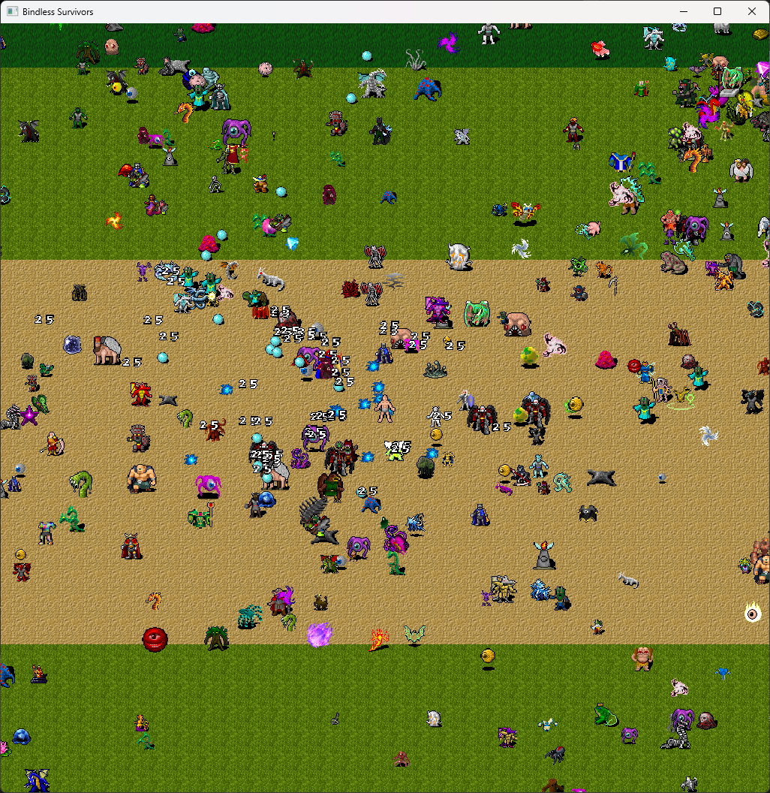

# Vulkan 2D Template

## About

Fun project I did during the days off at the end of 2024 to test my light Vulkan abstraction. It's a  bindless Vulkan 1.3 renderer using only two draw calls. One for rendering all the moving objects (sprites, projectiles, numbers) and one for the tileset. It can render lots of sprites at high framerates, though my actual goal was to do something that has some actual gameplay for a change.

**Note:** Experimental private project not guaranteed to work

## Media

(Click for a video)

## Credits

- Tiles and sprites from https://opengameart.org/content/dungeon-crawl-32x32-tiles 
- Music from https://opengameart.org/content/8-bit-infinite-darkness
